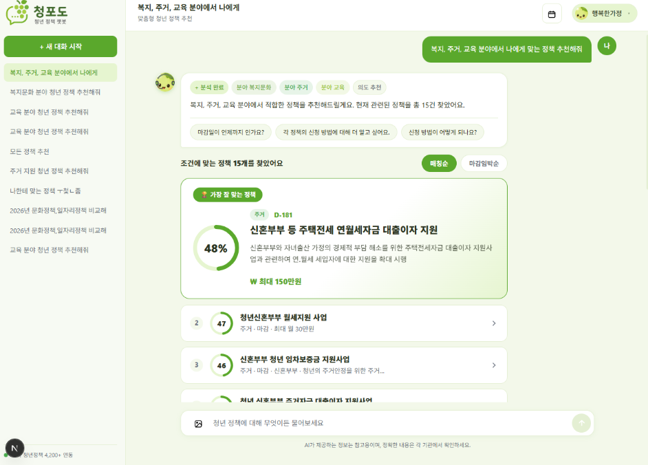
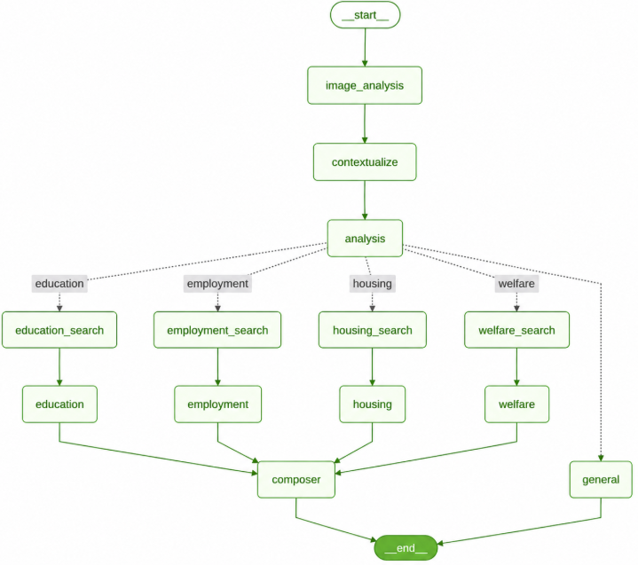

# 📚 청년정책지원 챗봇 '청포도' — Backend

온통청년 API 정책 데이터를 RAG로 검색해 주거·일자리·교육·복지문화 분야별 맞춤 답변을 제공하는 청년정책 AI 챗봇 백엔드

---

## 1. About Project

| 항목 | 내용 |
|------|------|
| 프로젝트 목적 | 청년 정책 정보를 RAG로 검색해 분야별 맞춤 답변을 제공하는 청년정책 지원 챗봇 |
| 프론트엔드 레포 | [rag-doc-chatbot-frontend](https://github.com/Minji6/rag-doc-chatbot-frontend) |
| 개발 기간 | 2026.06.16 ~ 2026.06.30 (2주) |

<p align="center">
  
</p>

---

## 2. Team Members

<table>
  <tbody>
    <tr>
      <td align="center">
        <a href="https://github.com/Minji6">
          
          <br />
          <sub><b>김민지</b></sub>
        </a>
        <br />
        <sub>팀장 · FullStack</sub>
        <br />
        <a href="https://github.com/Minji6">GitHub</a>
      </td>
      <td align="center">
        <a href="https://github.com/dlwldP">
          
          <br />
          <sub><b>이지예</b></sub>
        </a>
        <br />
        <sub>팀원 · FullStack</sub>
        <br />
        <a href="https://github.com/dlwldP">GitHub</a>
      </td>
      <td align="center">
        <a href="https://github.com/garden-kim-git">
          
          <br />
          <sub><b>김정원</b></sub>
        </a>
        <br />
        <sub>팀원 · FullStack</sub>
        <br />
        <a href="https://github.com/garden-kim-git">GitHub</a>
      </td>
      <td align="center">
        <a href="https://github.com/qqqkyj">
          
          <br />
          <sub><b>강연주</b></sub>
        </a>
        <br />
        <sub>팀원 · FullStack</sub>
        <br />
        <a href="https://github.com/qqqkyj">GitHub</a>
      </td>
    </tr>
  </tbody>
</table>

---

## 3. Key Features

| # | 기능 | 설명 | 활용 챕터 |
|---|------|------|----------|
| 1 | 도메인별 정책 RAG 답변 | 주거·일자리·교육·복지문화 4개 전담 에이전트가 PGVector에서 분야별 정책 검색 후 한국어 답변 생성 | sec07, sec08 |
| 2 | LangGraph 기반 Multi-Agent 오케스트레이션 | 의도 분석(analysis) → 해당 도메인으로 fan-out 병렬 검색 → composer가 fragment를 최종 답변으로 조립(fan-in) | sec09 |
| 3 | 후속질문 맥락 처리 | contextualize 노드가 후속질문을 독립형 질의로 재작성하고, 직전 턴 정책 메모리로 "두 번째 정책", "A랑 B 비교" 같은 참조를 해소 | sec09 |
| 4 | 정책 상세 조회 + 자격진단 + D-day | 정책 마감일 기반 D-day 계산, 로그인 사용자는 소득·학력 등 조건 기반 자격진단 결과를 상세 조회에 첨부 | sec07 |
| 5 | 정책 데이터 수집 + 임베딩 | 온통청년 오픈 API → httpx 수집 → 청킹 → PGVector 저장 | sec08 |
| 6 | 회원가입 · 로그인 | 회원/게스트 판별, AsyncPostgresSaver 전환 기준 | sec06 |
| 7 | 스트리밍 답변 출력 | astream + StreamingResponse 실시간 출력 | sec02, sec05 |

<p align="center">
  
</p>

---

## 4 Technology Stack

| 분류 | 기술 |
|------|------|
| Backend | Python · FastAPI · SQLAlchemy (async) · psycopg |
| AI | LangChain · LangGraph · OpenAI (gpt-4o-mini) · Tavily (웹 검색 보완) |
| Database | PostgreSQL · pgvector |
| DB 관리 | pgAdmin |
| Infra | Docker |
| Tools | GitHub · Visual Studio Code |

---

## 4-1. API 구조

| Prefix | 역할 |
|--------|------|
| `/api/chat` | 챗봇 대화 요청 (LangGraph Supervisor 실행) |
| `/api/auth` | 회원가입 · 조회 · 탈퇴 |
| `/chat_history` | 대화 기록 조회 · 삭제, 대화 목록 조회 |
| `/upload` | 청년정책 데이터(온통청년 API) 수집 · 임베딩 적재 |

### 디렉터리 구조 (`api/`)

```
api/
├── chat/                 # 챗봇 엔드포인트
├── chat_service/
│   ├── controller.py
│   ├── policy_memory.py  # 후속질문 해소용 직전 턴 정책 메모리
│   └── langgraph/
│       ├── supervisor.py # 그래프 정의 (fan-out → fan-in)
│       ├── state.py
│       ├── nodes/        # analysis, contextualize, image_analysis, composer, general 등
│       ├── agents/       # housing / employment / education / welfare 에이전트
│       └── tools/        # dday, age, eligibility, policy_search, suggestions 등
├── auth_service/         # 회원가입 · 로그인
├── history_service/      # 대화 기록 (InMemorySaver / AsyncPostgresSaver)
├── upload_service/       # 정책 데이터 수집 · 임베딩
├── models/
└── common/                # 예외 처리, DB 커넥션 풀 등 공통 유틸
```

---

## 5. Development Workflow

### 브랜치 전략

| 브랜치 | 역할 | 규칙 |
|--------|------|------|
| `main` | 최종 배포본 | 직접 push 금지, dev에서만 머지 |
| `dev` | 통합 개발 | feat/* PR 리뷰 후 머지 |
| `feat/{기능명}` | 기능 단위 개발 | 완료 후 dev로 PR |

### PR 규칙
- `feat/*` → `dev` PR 생성 후 팀원 2명 이상 리뷰 후 머지
- PR 제목 형식: `[feat] RAG 답변 API 구현`
- `dev` → `main`은 전체 기능 완료 후 최종 1회 머지

---

## 6. Convention

### 커밋 컨벤션

| 타입 | 설명 |
|------|------|
| `Feat` | 새로운 기능 추가 |
| `Fix` | 버그 수정 |
| `Docs` | 문서 수정 |
| `Style` | 코드 formatting, 세미콜론 누락 등 코드 변경 없는 경우 |
| `Refactor` | 코드 리팩토링 |
| `Test` | 테스트 코드 추가 및 리팩토링 |
| `Chore` | 패키지 매니저 수정, .gitignore 등 기타 수정 |
| `Comment` | 필요한 주석 추가 및 변경 |
| `Rename` | 파일 또는 폴더 명 수정 및 이동 |
| `Remove` | 파일 삭제 |
| `!HOTFIX` | 급하게 치명적인 버그를 고쳐야 하는 경우 |

**커밋 메시지 규칙**
- 커밋 유형은 영어 대문자로 작성
- 제목과 본문은 빈 행으로 분리
- 제목 첫 글자 대문자, 끝에 `.` 금지
- 제목은 영문 기준 50자 이내
- 본문에는 무엇을·왜 변경했는지 설명 (어떻게 X)
- 여러 항목은 글머리 기호로 작성

```
Feat: RAG 답변 API 구현

- 공식문서·수업자료 두 컬렉션 동시 검색 기능 추가
- Pydantic으로 출처 URL·버전·요약 구조화 출력
- 문서에 없는 질문 거절 처리 추가
```

### 코드 컨벤션 (Python / FastAPI)

| 대상 | 규칙 | 예시 |
|------|------|------|
| 클래스명 | PascalCase | `ChatRequest`, `EmbeddingService` |
| 함수·변수명 | snake_case | `get_chat_response`, `chat_history` |
| 상수 | UPPER_SNAKE_CASE | `MAX_TOKENS`, `COLLECTION_NAME` |
| 파일명 | snake_case | `chat_controller.py`, `rag_service.py` |
| 라우터 prefix | kebab-case | `/api/chat`, `/api/doc-linter` |
| DB 컬럼명 | snake_case | `created_at`, `board_id` |

**추가 규칙**
- 함수 하나는 하나의 역할만 수행
- controller는 요청/응답만, 비즈니스 로직은 service로 분리
- 비동기 함수는 `async def` 사용
- 타입 힌트 필수 작성
